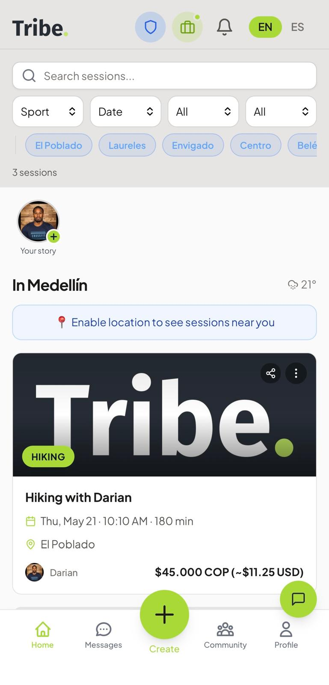
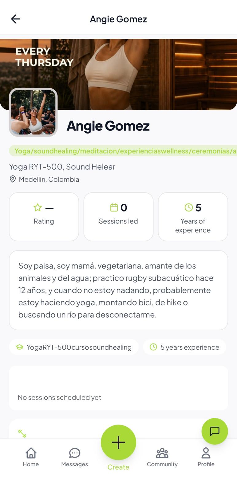
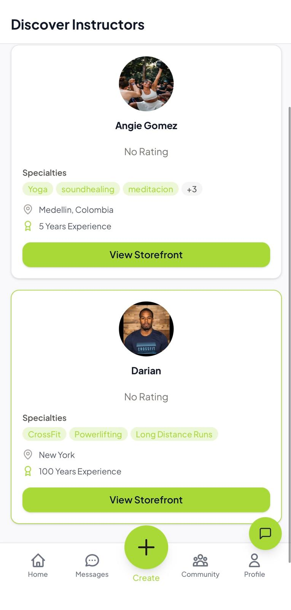
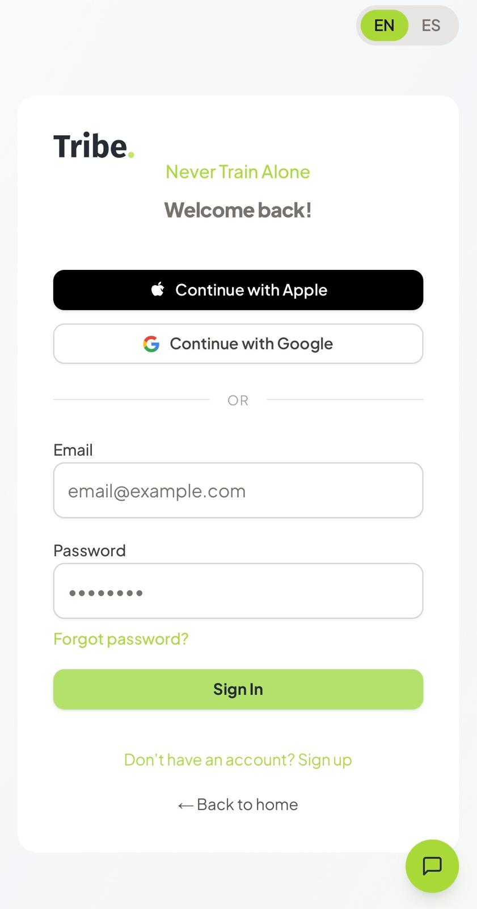
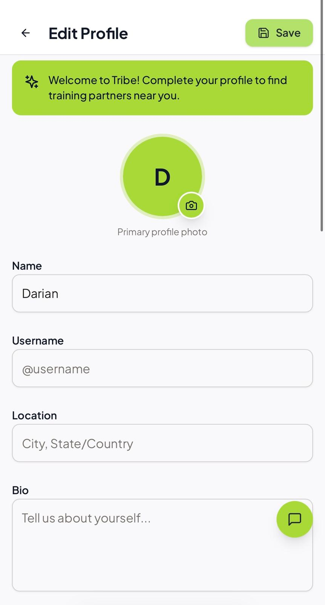
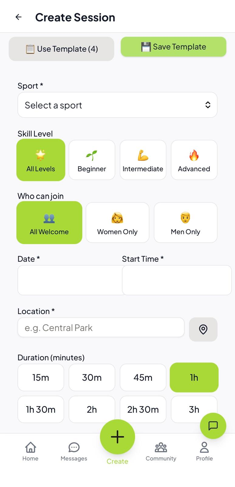
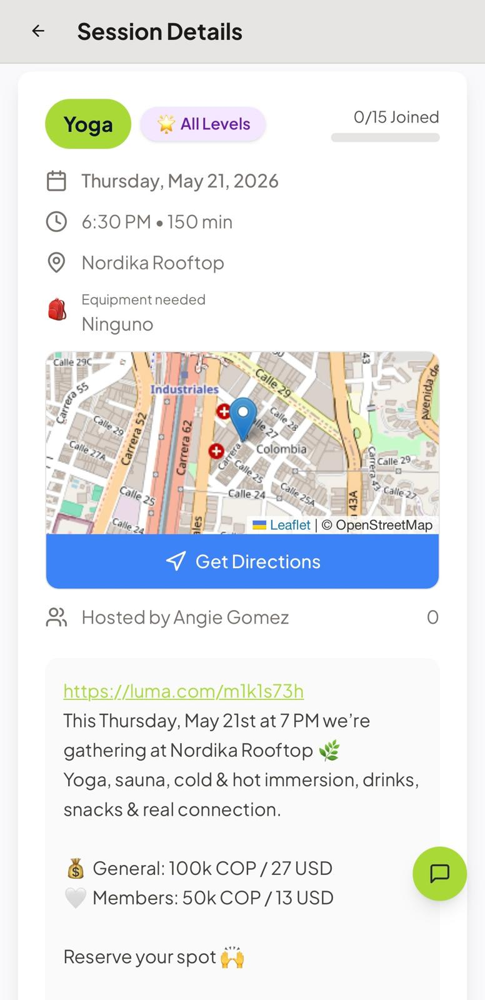

# You're invited to Tribe — Founding Instructor Guide

_(English master — review this, then I'll produce the Spanish version for Verónica to check before you send it to instructors.)_

---

## You've been invited

We're building Tribe — a home for fitness and wellness instructors in Medellín — and we're starting with a small, hand-picked group of founding instructors. This is an invitation to be one of them.

This isn't "download my app and help me out." It's the opposite. We're inviting you in early, while it's still being shaped, because the instructors who join now help decide what Tribe becomes. You get first claim on your space and your audience, your feedback steers what we build next, and you become one of the faces athletes see first as the community grows around you.

You'd be one of the founders of this in your neighborhood. We'd love for you to build it with us.

---

## What you get as a founding instructor

**A professional storefront.** One page with your photo, bio, specialties, upcoming sessions, and reviews. It makes you look as legit as you are — no website to build.

**Discovery.** You show up in "Descubre Instructores" so athletes around Medellín can find you, not just the people already in your contacts.

**The rest of what's included:**

- **One link that sells for you.** Share your session or storefront link to your WhatsApp groups and Instagram. Anyone who taps it can see the details and join — even before they have an account.
- **RSVPs and reminders, handled.** Tribe tracks who's coming and sends them reminders. No more counting heads in a spreadsheet or wondering who'll actually arrive.
- **Tips.** Athletes can send you a tip after a session — real money, straight to you.
- **Reviews.** Every happy athlete can leave a rating, so your reputation builds itself over time.
- **A direct line to shape it.** As a founding instructor, what you tell us actually changes the product. You're not a number — you're a co-creator.
- **We promote you.** We feature our founding instructors on Tribe's social media, tagging and crediting you, so your reach grows as ours does.
- **Free to start.** Build your storefront and host your first session without paying anything.

---

## Get live in 7 steps (about 15 minutes)

**1. Create your account.** Download Tribe (App Store / Google Play) or open the link we send you. Sign up with your email, Apple, or Google.

**2. Choose "I'm an instructor."** This unlocks your storefront and the tools to host sessions and get paid.

**3. Build your profile.** Add your name, a clear photo, and a short bio in your own voice — this is what athletes read first. _You don't have to finish everything now — there's a "skip and finish later" option, and you can polish your profile anytime._

**4. Set up your storefront.** Add a tagline (one line on what you do) and a banner image. This is the page people land on when they tap your link.

**5. (If you'll charge) Set up payouts.** If you plan to take payment through the app, connect your payout method — Wompi for Colombian pesos (Nequi, PSE, card) or Stripe for US dollars. _You can also keep payment off-app for now and just use Tribe to coordinate — your choice._

**6. Create your first session.** Pick your activity, set the date, time, location, how many people can join, and the price (or mark it free). Write the description in your own words — your style, your language.

**7. Share it.** Open your new session and share the link to your WhatsApp groups and Instagram. People find it, tap, and join. They can also get directions, ask questions, and see who else is coming.

---

## After your first session

- **See who's coming** on the session page, and message the group directly through Tribe.
- **Athletes get reminders** automatically, so more of them show up.
- **Ask happy athletes to leave a review** — it's the fastest way to build trust with people who don't know you yet.
- **Post more sessions** — a recurring weekly class, a special event, whatever fits your practice. Each one is a new link to share.
- **Tell us what's missing.** You're early — if something would make Tribe better for you, say so. That's exactly what founding instructors are here for.

---

## A few things worth knowing

- **Your words, your style.** The session title and description are entirely yours. If you teach a philosophy-first practice, write it that way — Tribe doesn't force a "fitness" tone on your content.
- **Packages.** You can list your pricing tiers (single class, multi-class packs, monthly) on your storefront so athletes see your options. For now, when someone wants a package they reach out to you to arrange it — payment for packages is handled with you directly.
- **Spanish or English.** The app works in both. Write your profile and sessions in whichever language your athletes use — for most instructors here, that's Spanish.
- **Sharing your content.** By joining as a founding instructor, you agree to let us feature your sessions and photos on Tribe's channels, always crediting and tagging you. You keep ownership of your content, and you can ask us to stop anytime.
- **Need help?** Reach out to us at tribe@aplusfitnessllc.com.

---

_Tribe — Never Train Alone._
