# Tribe — Full App Audit, Executive Summary (2026-09-04)

Read-only audit of the Tribe consumer app and Tribe.OS against **code** (`tribe-v3`, branch `main` @ `613eddf`, migrations through `155`) and the **live database** (Supabase project `twyplulysepbeypqralz`). No application code was modified. Companion files: `TRIBE_AUDIT_TICKETS.md` (95 tickets, full text) and `TRIBE_AUDIT_TICKETS.csv` (Notion import). All 95 tickets were pushed to the Notion **Build Backlog** on 2026-09-04: 46 existing rows received an audit block at the top of their page body (plus 7 note-only rows for leads verified as already fixed or clarified), and 50 new rows were created. Four new Área options were added to the board: Flujo/Navegación, Seguridad, Pagos, Negocio.

## How the live DB was read

`pg_dump` needs Docker, which is not installed on this machine, so the schema was pulled through the Supabase CLI login role instead: `supabase gen types typescript --linked` (all 88 public tables, 4 views, 42 functions with every column), `supabase inspect db` (index usage and sizes), and `supabase db lint --linked` (plpgsql_check over every live function). `supabase migration list --linked` was also run. What this cannot show: grants, RLS policy bodies and trigger bodies. Three findings that hinge on those are marked **Por verificar** with the exact read-only SQL to run in the SQL editor (SEC-01, INS-02, SEC-12).

## The short version

1. **The route table is stable; the graph over it is not.** All 95 pages and 109 API routes from the 2026-08-25 inventory re-verify byte-identical. What makes the app feel disconnected is wiring: the back arrow on `/session/[id]` (35 inbound links) is a hard `Link href="/"`; "Mis Sesiones" exists but nothing in the app links to it while three push/email paths send users there; the App Store modal fires on `/s/` and `/i/` (the actual share funnel) 3 seconds in; 14 routes are orphans; two links 404; deep links are configured on neither platform.
2. **Two things are structurally broken in the live DB, not the code.** `products` and `product_orders` do not exist in production (migration 013 was never applied; `finalize_payment` fails lint with `relation "product_orders" does not exist`), yet the whole product marketplace ships and every storefront now shows a "Productos" tab because the count query fails open. And 19 live tables (payments, messages, chat*messages, push*\*, instructor_posts, post_likes, service_packages, storefront_media, session_attendance, …) have no `CREATE TABLE` anywhere in the repo; the remote migration-history table is empty.
3. **Money is more armed than the product rule allows.** The live paid-session path is off-platform (correct). But `/api/payment/create` still has fully built Stripe/Wompi branches with no server gate: boost and pro-storefront pay Tribe 100% with no delivery; session checkout makes Tribe merchant of record; Wompi retains everything with no payout code. `INSTRUCTOR_PAYMENTS_ENABLED` exists only in the spec. Marketing still says "keep 85%". Product orders show "Purchase successful" without any payment. See the decision section at the end.
4. **Notifications are quieter than anyone thinks.** Direct messages never push (the webhook resolves recipients by `session_id`, which is NULL for DMs). Five cron routes exist but are unscheduled, so no session reminder of any kind fires and the weekly recap email is unreachable; the reminder crons also parse Bogotá times as UTC. Eight push senders bypass user preferences. `cancelSession` notifies nobody (browser-side call with a server-only secret, and an empty recipient list) and marks refunds failed.
5. **Security posture is mostly good, with three sharp edges.** Roster PII, join policy, capacity on self-join, admin/banned self-escalation, cron fail-open and the notify-nearby blast are all closed. Open: migration 093 re-granted table-level `SELECT` on `users` to `authenticated`, which (by a Postgres rule this repo has already been bitten by twice) neuters the later column revokes of `email`, coordinates, `is_admin` and payout fields; `tribe_os_tier` / `is_verified_instructor` / `subscription_tier` have no write guard, so any user can self-grant premium with one PATCH; and `notify-join`'s `leave`/`guest` kinds let any user put attacker-chosen text into any host's bell and push.
6. **Instructor self-serve has one dead end that hits every new instructor**: the onboarding wizard never asks for `location`, but the completeness gate requires it, so every instructor finishes "incomplete" and is filtered out of the directory. And no gym can be created without Stripe billing, so the multi-coach story is unreachable for everyone.

---

## Navigation map

Solid arrows are in-app links. Dashed arrows are server-originated (push, email, OAuth, payment gateway). Red nodes are orphans (no inbound link). Orange nodes are reachable only through an orphan or a dead component.

```mermaid
flowchart TD
  classDef orphan fill:#ffd6d6,stroke:#c00,color:#000
  classDef weak fill:#ffe8c2,stroke:#c60,color:#000
  classDef pub fill:#e6f4d5,stroke:#5a8a1a,color:#000
  classDef nav fill:#C0E863,stroke:#272D34,color:#000,font-weight:bold

  subgraph BottomNav["BottomNav (5 entries, identical for every role)"]
    HOME["/ Home"]:::nav
    MSG["/messages"]:::nav
    CREATE["/create"]:::nav
    COMM["/communities"]:::nav
    PROF["/profile"]:::nav
  end

  subgraph Public["Public (middleware publicPaths)"]
    LAND["/ (logged out) LandingPage"]:::pub
    AUTH["/auth"]:::pub
    S["/s/[id] share card (OG)"]:::pub
    I["/i/[id] instructor card (OG)"]:::pub
    INV["/invite/[token] (OG)"]:::pub
    SESS["/session/[id]"]:::pub
    DL["/download"]:::pub
    LEGAL["/legal/*, /about, /faq, /for-instructors"]:::pub
  end

  LAND --> AUTH
  AUTH -.OAuth.-> CB["/auth/callback"] --> ROLE["/onboarding/role"] --> ONBI["/onboarding/instructor"] --> PAYOUT["/earnings/payout-settings"]
  ROLE --> PEDIT["/profile/edit"]
  S -->|CTA logged in| SESS
  S -->|CTA logged out| AUTH
  I -->|CTA| STORE["/storefront/[id]"]
  INV -->|accept| SESS
  DL -.QR blocked by CSP.-> DL

  HOME --> SESS
  HOME --> STORE
  HOME --> TP["/training-partners (only via home rail)"]
  HOME --> REF["/referral"]
  HOME --> NOTIF["/notifications"]
  HOME --> OSD["/os/dashboard (TribeOSQuickAccess)"]
  HOME --> ADMIN["/admin (AdminQuickAccess)"]
  HOME -.FeedPostPreview.-> FEED["/feed"]

  MSG --> THREAD["/messages/[id]"]
  MSG --> SESS
  CREATE --> SESS
  CREATE --> OSD
  COMM --> CID["/communities/[id]"] --> CPOST["/communities/[id]/post"]
  CID -.404.-> CCOMM["/communities/[id]/post/[id]/comments (no route)"]:::orphan
  COMM --> CCREATE["/communities/create"]
  PROF --> SET["/settings"]
  PROF --> MYT["/my-training"]
  PROF --> DASH["/dashboard/instructor (instructor only)"]
  PROF --> PART["/partners (instructor only)"]
  PROF --> PEDIT
  PROF --> MYCOACH["/my-coach (gym clients only)"]

  SESS --> SEDIT["/session/[id]/edit"]
  SESS --> SCHAT["/session/[id]/chat"]
  SESS --> PUB["/profile/[userId]"]
  SESS --> STORE
  SESS -.back arrow = Link href='/'.-> HOME
  PUB --> STORE
  STORE --> PROD["/product/[id] (table missing in live DB)"]:::weak
  STORE --> CPROD["/create-product (table missing in live DB)"]:::weak
  STORE --> MSG

  SET --> ADMIN --> ABUL["/admin/bulletin"]
  ADMIN --> AEV["/admin/events"]
  ADMIN --> APART["/admin/partners"]
  SET --> MYORD["/my-orders"]
  SET --> FEEDB["/feedback"]
  SET --> BLOCKED["/settings/blocked"]
  SET --> LEGAL

  DASH --> DISC["/dashboard/instructor/discover (Reach Out always fails)"]:::weak
  DASH --> EARN["/earnings"] --> ORD["/orders"]
  FEED --> PROMO["/promote"] --> PB["/promote/boosts"]
  PROMO --> PP["/promote/packages"]
  PROMO --> PPO["/promote/posts"]
  PROMO --> PC["/promote/promo-codes"]
  PART --> PAPPLY["/partners/apply"] --> DPART["/dashboard/partner"]

  OSD --> OSM["/os/members"]
  OSD --> OST["/os/teams"] --> OSTID["/os/teams/[id]"]
  OSD --> OSS["/os/schedule"] --> OSATT["/os/sessions/[id]/attendance"]
  OSD --> OSR["/os/revenue"] --> OSU["/os/revenue/unpaid"]
  OSD --> OSI["/os/intelligence"]
  OSD --> OSSET["/os/settings -> redirects /os/gym"] --> OSG["/os/gym (no create-gym form)"]:::weak
  OSM --> OSC["/os/clients/[id]"] --> OSCE["/os/clients/[id]/edit"]
  OSM --> OSCN["/os/clients/new"]
  OSG --> OSA["/os/audit"]
  OSCLI["/os/clients -> redirects /os/members"]

  %% server-originated
  PUSH(("push / email")):::pub
  PUSH -.engagement, weekly recap, inactive nudge.-> SESSIONS["/sessions Mis Sesiones"]:::orphan
  PUSH -.follow, connection_request.-> PUB
  PUSH -.invite.-> INV
  GATEWAY(("Stripe / Wompi return")):::pub -.-> PAYCONF["/payment/confirm (not in publicPaths)"]:::weak

  %% orphans
  SEARCH["/search (only link to /challenges and /sessions)"]:::orphan
  SEARCH -.404 /sessions/[id].-> SESS
  SEARCH --> CHAL["/challenges"]:::weak --> CHALID["/challenges/[id]"]:::weak
  CHAL --> CHALC["/challenges/create"]:::weak
  SEARCH --> SESSIONS
  CONN["/connections (co-attendance inbox)"]:::orphan
  REQ["/requests (host approvals)"]:::orphan
  FEEDV2["/feed/v2"]:::orphan
  STORIES["/stories"]:::orphan
  TNOW["/training-now"]:::orphan
  SNOTIF["/settings/notifications"]:::orphan
  STRAIN["/settings/training-preferences (only writer of seeking_trainer_*)"]:::orphan
  TPLUS["/tribe-plus (admin-only by design)"]:::orphan --> SUBS["/subscriptions"]:::orphan
  DELACC["/legal/delete-account (store compliance)"]:::orphan
  OSMSG["/os/messages (ComingSoon)"]:::orphan
  OSPROG["/os/programs (ComingSoon)"]:::orphan
  MATCH["/matches (linker SmartMatchBanner is unmounted)"]:::orphan
  STRAIN -.feeds.-> DISC
```

---

## Full route table

Derived from `docs/ROUTE_INVENTORY_2026-08-16.md` (re-verified against `613eddf`: zero route delta) with the "Reachable?" column recomputed from the current inbound-link graph. Auth is middleware-level; "(admin)" and "(premium)" are page/API-level gates. The 109 API routes are enumerated in `docs/ROUTE_INVENTORY_2026-08-16.md`; the audit-relevant ones are: `/api/notify-admin-signup` and `/api/admin/notify` (called server-to-server without a cookie, so middleware kills them), `/api/products/*` (tables missing live), `/api/payment/create` (no server kill switch), five `/api/cron/*` routes not in `vercel.json`.

| Path                             | Purpose                                                                | Entry points                                                                                                   | Reachable?                      | Auth / role                                     | Issues                                                                                     |
| -------------------------------- | ---------------------------------------------------------------------- | -------------------------------------------------------------------------------------------------------------- | ------------------------------- | ----------------------------------------------- | ------------------------------------------------------------------------------------------ |
| `/`                              | The only surface that mounts `FindTrainingPartners`, `ReferralBanner`, | BottomNav (Home); `not-found.tsx`; `global-error.tsx`; `/messages`; `/create-product`; `/auth`; `/promote`; `/ | Y                               | public · guest + both                           | Logged out: `LandingPage`. Logged in with no sessions: empty-feed card plus the discovery  |
| `/about`                         | guest                                                                  | `MarketingLayout` nav                                                                                          | Y                               | public · guest                                  | Static copy                                                                                |
| `/admin`                         | internal                                                               | `/settings`; `AdminQuickAccess` (in home `FilterBar`)                                                          | Y                               | authenticated (page-gated admin) · internal     | Non-admin: bounced by `fetchUserIsAdmin` at `app/admin/page.tsx:60`                        |
| `/admin/bulletin`                | internal                                                               | `/admin`                                                                                                       | Y                               | authenticated (page-gated admin) · internal     | "No approved posts" / "No hay posts pendientes"; unauth → `router.push('/auth')`           |
| `/admin/events`                  | internal                                                               | `/admin`                                                                                                       | Y                               | authenticated (page-gated admin) · internal     | "No events yet"; non-admin → "No autorizado"                                               |
| `/admin/partners`                | Featured-affiliate application queue                                   | `/admin`                                                                                                       | Y                               | authenticated (page-gated admin) · internal     | Empty application list                                                                     |
| `/auth`                          | guest                                                                  | 53 call sites; every middleware bounce; every page-level unauth redirect                                       | Y                               | public · guest                                  | Sign-in form                                                                               |
| `/auth/callback`                 | Not an ORPHAN — external redirect target                               | **No in-app link.** Reached only as the Supabase OAuth `redirectTo` (`app/auth/useAuthHandlers.ts:129,167`; `a | external only                   | public (under `/auth`) · guest                  | Forwards to `consumePendingReturnTo() ?? /onboarding/role`                                 |
| `/challenges`                    | Sole inbound link is from an ORPHAN page, so effectively unreachable   | `/search` only                                                                                                 | N (only via orphan/dead linker) | authenticated · both                            | "No challenges yet"; unauth → `/auth`                                                      |
| `/challenges/[id]`               | both                                                                   | `/challenges`; `/challenges/create`; `/search`                                                                 | N (only via orphan/dead linker) | authenticated · both                            | "No athletes yet"                                                                          |
| `/challenges/create`             | both                                                                   | `/challenges`                                                                                                  | N (only via orphan/dead linker) | authenticated · both                            | Blank form                                                                                 |
| `/communities`                   | both                                                                   | **BottomNav (Community)**; `/search`; `CommunityCard`; `CommunityEventsTab`                                    | Y                               | authenticated · both                            | Empty list                                                                                 |
| `/communities/[id]`              | both                                                                   | `/communities`; `CommunityCard`; sibling community pages; `/search`                                            | Y                               | authenticated · both                            | "No posts yet" / "No members"                                                              |
| `/communities/[id]/event`        | Create form, not a detail view                                         | `/communities/[id]`; `CommunityEventsTab`                                                                      | Y                               | authenticated · both                            | Blank create-event form                                                                    |
| `/communities/[id]/post`         | both                                                                   | `/communities/[id]`                                                                                            | Y                               | authenticated · both                            | Blank create-post form                                                                     |
| `/communities/create`            | both                                                                   | `/communities`                                                                                                 | Y                               | authenticated · both                            | Blank form                                                                                 |
| `/connections`                   | Co-attendance funnel inbox                                             | **ORPHAN**                                                                                                     | **N (orphan)**                  | authenticated · athlete                         | "No connections yet" / "No pending requests"; unauth → `/auth`                             |
| `/create`                        | both                                                                   | **BottomNav (centre + button)**; 20 other call sites                                                           | Y                               | authenticated · both                            | Blank session form; instructor-only block at line 624                                      |
| `/create-product`                | instructor                                                             | `StorefrontProductsSection`                                                                                    | Y                               | authenticated · instructor                      | Blank form; unauth → `/auth`                                                               |
| `/dashboard/instructor`          | Mounts `TribeOSEntryCard`, `PayoutSetupBanner`                         | `/profile` (instructor-only tile)                                                                              | Y                               | authenticated · instructor                      | Renders with zeroes                                                                        |
| `/dashboard/instructor/discover` | Athlete-lead directory                                                 | `/dashboard/instructor`                                                                                        | N (only via orphan/dead linker) | authenticated · instructor                      | "No athletes match these filters" / "Sin créditos"; unauth → `/auth`                       |
| `/dashboard/partner`             | instructor                                                             | `/partners/apply`                                                                                              | Y                               | authenticated · instructor                      | Affiliate dashboard; unauth → `/auth`                                                      |
| `/earnings`                      | instructor                                                             | `/orders`; `PayoutSetupBanner`; `StripeConnectBanner`; `InstructorAnalytics`                                   | Y                               | authenticated · instructor                      | "No transactions yet"; non-instructor bounced at line 162/287                              |
| `/earnings/payout-settings`      | Stripe Connect is US-hardcoded and hidden                              | `PayoutSetupBanner`; `StripeConnectBanner`                                                                     | Y                               | authenticated · instructor                      | "No configurado"                                                                           |
| `/faq`                           | guest                                                                  | `MarketingLayout`; `FAQPreviewSection`                                                                         | Y                               | public · guest                                  | Static copy                                                                                |
| `/feed`                          | both                                                                   | `/settings`; OSShell; `FeedPostPreview` (home slot 2)                                                          | Y                               | authenticated · both                            | "No more posts"; unauth → `/auth`; instructor-only compose at line 338                     |
| `/feed/v2`                       | Duplicate of `/feed` on the `fetchFeedPosts` DAL                       | **ORPHAN**                                                                                                     | **N (orphan)**                  | authenticated · both                            | Empty post list                                                                            |
| `/feedback`                      | both                                                                   | `/settings` (×2, plus `?tab=bug`); OSShell help link                                                           | Y                               | authenticated · both                            | Blank form                                                                                 |
| `/for-instructors`               | guest                                                                  | `MarketingLayout`; `HeroSection`; `ForInstructorsPreview`                                                      | Y                               | public · guest                                  | Static copy                                                                                |
| `/i/[id]`                        | Public instructor share card                                           | **No in-app link.** Minted by `getInstructorShareUrl` (`lib/share.ts:64`), used by the share sheet on `/profil | external only                   | public · guest                                  | "Instructor not found" + "Go to Tribe" → `/`                                               |
| `/instructors`                   | Instructor directory                                                   | `/communities`; `/feed`; `/feed/v2`; `FeaturedInstructors`                                                     | N (only via orphan/dead linker) | authenticated · athlete                         | Empty list                                                                                 |
| `/invite/[token]`                | guest + both                                                           | `/notifications`                                                                                               | Y                               | public · guest + both                           | Invalid/expired/fetch-failure all render the identical generic card (deliberately not an e |
| `/legal/delete-account`          | App-store compliance page                                              | **ORPHAN**                                                                                                     | **N (orphan)**                  | public · guest + both                           | Static copy                                                                                |
| `/legal/privacy`                 | guest + both                                                           | `/settings`; `EmailAuthForm`; `MarketingLayout`                                                                | Y                               | public · guest + both                           | Static                                                                                     |
| `/legal/safety`                  | guest + both                                                           | `/settings`; `SafetyWaiverModal`                                                                               | Y                               | public · guest + both                           | Static                                                                                     |
| `/legal/terms`                   | guest + both                                                           | `/settings`; `EmailAuthForm`; `MarketingLayout`                                                                | Y                               | public · guest + both                           | Static                                                                                     |
| `/matches`                       | Join requests + tribe sessions                                         | `SmartMatchBanner` **which is imported by nothing** — effectively ORPHAN                                       | **N (orphan)**                  | authenticated · athlete                         | Renders an empty `
` when `!user`                                                        |
| `/messages`                      | both                                                                   | **BottomNav (Messages, with unread badge)**; 9 other call sites                                                | Y                               | authenticated · both                            | Empty conversation list                                                                    |
| `/messages/[conversationId]`     | both                                                                   | `/messages`                                                                                                    | Y                               | authenticated · both                            | "No se pudieron cargar los mensajes"; unauth → `/auth`                                     |
| `/my-coach`                      | athlete                                                                | `MyCoachEntryCard` on `/profile` (self-hides for non-gym users)                                                | Y                               | authenticated · athlete                         | Card hides itself; direct visit by a non-client renders the empty dashboard. Unauth → `/au |
| `/my-orders`                     | Buyer side                                                             | `/settings`; `/product/[id]`                                                                                   | Y                               | authenticated · athlete                         | "No orders yet"; unauth → `/auth`                                                          |
| `/my-training`                   | athlete                                                                | `/profile`                                                                                                     | Y                               | authenticated · athlete                         | Empty streak grid; unauth → `/auth`                                                        |
| `/notifications`                 | Only route that links `/invite/[token]`                                | `NotificationBell` (home `FilterBar`)                                                                          | Y                               | authenticated · both                            | Empty list                                                                                 |
| `/onboarding/instructor`         | instructor                                                             | `/onboarding/role`                                                                                             | Y                               | authenticated · instructor                      | Wizard; unauth → `/auth`                                                                   |
| `/onboarding/role`               | both                                                                   | `/auth/callback`                                                                                               | Y                               | authenticated · both                            | Role picker; unauth → `/auth`                                                              |
| `/orders`                        | Seller side                                                            | `/earnings`                                                                                                    | Y                               | authenticated · instructor                      | "No orders yet"; unauth → `/auth`                                                          |
| `/os/audit`                      | Not in OS nav                                                          | `/os/gym`; `AuditActivityChip`                                                                                 | Y                               | authenticated (page-gated premium) · instructor | "No entries yet" / "No entries match these filters"                                        |
| `/os/clients`                    | Pure redirect shim for old bookmarks                                   | `/os/teams/[id]`; `/os/members`; `/os/revenue/unpaid`; several OS widgets                                      | Y                               | authenticated · instructor                      | Renders `null`, then `router.replace('/os/members')`                                       |
| `/os/clients/[id]`               | Survives the `/os/clients` redirect because it is a more specific rout | `/os/members`; `/os/teams/[id]`; `/os/revenue/unpaid`; `AtRiskClientsWidget`; `TrainingPartnersSection`; `Cele | Y                               | authenticated (premium) · instructor            | "No se pudo cargar el cliente"                                                             |
| `/os/clients/[id]/edit`          | instructor                                                             | `/os/clients/[id]`                                                                                             | Y                               | authenticated (premium) · instructor            | Prefilled form                                                                             |
| `/os/clients/new`                | instructor                                                             | `/os/members`; `AtRiskClientsWidget`; `OnboardingChecklist`                                                    | Y                               | authenticated (premium) · instructor            | Blank form                                                                                 |
| `/os/coaches`                    | Not in OS nav                                                          | `OnboardingChecklist`                                                                                          | Y                               | authenticated (premium) · instructor            | "No gym yet" / "No recorded actions yet"                                                   |
| `/os/dashboard`                  | Primary OS entry                                                       | **OSShell nav (Dashboard)**; `TribeOSQuickAccess` (home FilterBar); `TribeOSEntryCard` (`/settings`, `/dashboa | Y                               | authenticated (premium) · instructor            | Onboarding checklist; unauth → `/auth?returnTo=/os/dashboard/`                             |
| `/os/gym`                        | instructor                                                             | `/os/settings` (redirect target); `/os/dashboard`; `/os/audit`                                                 | Y                               | authenticated (premium) · instructor            | "No gym yet"                                                                               |
| `/os/intelligence`               | instructor                                                             | **OSShell nav**; `InsightsBanner`; `OSShellBell`                                                               | Y                               | authenticated (premium) · instructor            | "No insights yet" / "No insights match these filters"                                      |
| `/os/members`                    | Replaces the old `/os/clients` list                                    | **OSShell nav**; `/os/clients` redirect; `/os/intelligence`; `CelebrateWinsWidget`                             | Y                               | authenticated (premium) · instructor            | Empty table under the filter pills                                                         |
| `/os/messages`                   | Unbuilt by design; route kept for deep links                           | **ORPHAN** (deliberately omitted from OSShell `NAV_ITEMS`)                                                     | **N (orphan)**                  | authenticated (premium) · instructor            | `ComingSoonPage` placeholder                                                               |
| `/os/programs`                   | Unbuilt by design                                                      | **ORPHAN** (deliberately omitted from OSShell `NAV_ITEMS`)                                                     | **N (orphan)**                  | authenticated (premium) · instructor            | `ComingSoonPage` placeholder                                                               |
| `/os/revenue`                    | Mounts `StripeConnectBanner`                                           | **OSShell nav**                                                                                                | Y                               | authenticated (premium) · instructor            | `EmptyState` → `/create`                                                                   |
| `/os/revenue/unpaid`             | instructor                                                             | `/os/revenue`                                                                                                  | Y                               | authenticated (premium) · instructor            | "No phone on file" per row                                                                 |
| `/os/schedule`                   | instructor                                                             | **OSShell nav**; `UpcomingSessionsCard`                                                                        | Y                               | authenticated (premium) · instructor            | Empty week grid → `/create`                                                                |
| `/os/sessions/[id]/attendance`   | instructor                                                             | `/os/schedule`; `RecordGroupAttendanceButton`; `RecentlyEndedSessionPrompt`                                    | Y                               | authenticated (premium) · instructor            | "No changes" / "Sin cambios"                                                               |
| `/os/settings`                   | Second redirect shim in `/os`                                          | **OSShell nav (Settings)**                                                                                     | Y                               | authenticated (premium) · instructor            | Redirects to `/os/gym`                                                                     |
| `/os/teams`                      | instructor                                                             | **OSShell nav**                                                                                                | Y                               | authenticated (premium) · instructor            | "No teams yet" / "No gym yet"                                                              |
| `/os/teams/[id]`                 | instructor                                                             | `/os/teams`                                                                                                    | Y                               | authenticated (premium) · instructor            | "No members yet"                                                                           |
| `/partners`                      | Al has flagged this program for gating                                 | `/settings`; `/profile` (instructor-only tile); `/dashboard/partner`; `FeaturedPartnerBanner`                  | Y                               | authenticated · instructor                      | Marketing copy for the affiliate program                                                   |
| `/partners/apply`                | instructor                                                             | `/partners`                                                                                                    | Y                               | authenticated · instructor                      | Blank form; unauth → `/auth`                                                               |
| `/payment/confirm`               | Not an ORPHAN — external redirect target                               | **No in-app link.** Reached as the gateway return URL (`app/api/payment/create/route.ts:179,206,598,656`)      | external only                   | authenticated · both                            | Falls back to `/` or `/session/[id]`                                                       |
| `/product/[id]`                  | athlete                                                                | `StorefrontProductsSection`                                                                                    | Y                               | authenticated · athlete                         | Server Component; missing product → not-found                                              |
| `/profile`                       | Links out to only `/`, `/settings`, `/my-training`, `/dashboard/instru | **BottomNav (Profile)**; 31 call sites                                                                         | Y                               | authenticated · both                            | Own profile with empty bio/photos                                                          |
| `/profile/[userId]`              | ISR `revalidate = 60`                                                  | 19 navigation call sites (see Q1)                                                                              | Y                               | authenticated · both                            | Missing profile → not-found card with a back button                                        |
| `/profile/edit`                  | both                                                                   | `/profile`; `/earnings`; `/earnings/payout-settings`; `ProfileCompletionBanner`; `InstructorProfileIncompleteB | Y                               | authenticated · both                            | Blank form                                                                                 |
| `/promote`                       | Hub for the four `/promote/*` children                                 | `/feed`                                                                                                        | Y                               | authenticated · instructor                      | Non-instructor → access-denied panel (line 169)                                            |
| `/promote/boosts`                | instructor                                                             | `/promote`                                                                                                     | Y                               | authenticated · instructor                      | "No active campaigns yet"                                                                  |
| `/promote/packages`              | instructor                                                             | `/promote`                                                                                                     | Y                               | authenticated · instructor                      | Empty package list                                                                         |
| `/promote/posts`                 | instructor                                                             | `/promote`; `/feed`                                                                                            | Y                               | authenticated · instructor                      | "No upcoming sessions"; unauth → `/auth`                                                   |
| `/promote/promo-codes`           | instructor                                                             | `/promote`                                                                                                     | Y                               | authenticated · instructor                      | "No promo codes yet"                                                                       |
| `/referral`                      | both                                                                   | `ReferralBanner` (home slot 10)                                                                                | Y                               | authenticated · both                            | Renders with a code and zero stats                                                         |
| `/requests`                      | Incoming join requests for curated sessions                            | **ORPHAN**                                                                                                     | **N (orphan)**                  | authenticated · instructor / host               | Empty request list; unauth → `/auth`                                                       |
| `/s/[id]`                        | Public session share card                                              | **No in-app link.** Minted by `getSessionShareUrl` (`lib/share.ts:60`) and used by `useSessionActions`, `Whats | external only                   | public · guest                                  | "Session not found" + "Go to Tribe" → `/`                                                  |
| `/search`                        | Four tabs (people / communities / challenges / sessions)               | **ORPHAN**                                                                                                     | **N (orphan)**                  | authenticated · both                            | "No results found"; unauth → `/auth`                                                       |
| `/session/[id]`                  | Anon reads go through `fetchSessionPublicView`, signed-in through `fet | 35 call sites — home feed, `/messages`, `/matches`, `/subscriptions`, `/sessions`, `/my-training`, `/notificat | Y                               | public · guest + both                           | Missing row → "Session not found"; transient/RLS error deliberately does **not** show that |
| `/session/[id]/chat`             | Public in middleware, useless logged out                               | `/session/[id]`; `/messages`                                                                                   | Y                               | public (prefix) · both                          | Logged out or error → "Could not load chat" + Try again                                    |
| `/session/[id]/edit`             | Public in middleware, gated in `useEditSession                         | `/session/[id]`; home feed (`app/page.tsx:373`)                                                                | Y                               | public (prefix) · instructor / host             | Unauth → `router.replace('/auth?returnTo=...')`; non-creator → `/session/[id]`             |
| `/sessions`                      | Sole inbound link is from an ORPHAN page                               | `/search` only                                                                                                 | N (only via orphan/dead linker) | authenticated · both                            | Empty upcoming/past tabs                                                                   |
| `/settings`                      | Mounts `TribeOSEntryCard` and `TrainingPreferencesForm`                | `/profile`; `/admin`; `/legal/delete-account`; `/legal/terms`; `SmartMatchBanner` (dead)                       | Y                               | authenticated · both                            | Renders with defaults                                                                      |
| `/settings/blocked`              | both                                                                   | `/settings`                                                                                                    | Y                               | authenticated · both                            | Empty block list; unauth → `/auth?returnTo=/settings/blocked`                              |
| `/settings/notifications`        | Per-type notification preferences                                      | **ORPHAN**                                                                                                     | **N (orphan)**                  | authenticated · both                            | Toggle list at defaults; unauth → `/auth`                                                  |
| `/settings/training-preferences` | Only writer of `users                                                  | **ORPHAN**                                                                                                     | **N (orphan)**                  | authenticated · athlete                         | Blank preference form; unauth → `/auth`                                                    |
| `/storefront/[id]`               | Tabs self-hide when their collection is empty                          | 20 navigation call sites (see Q1)                                                                              | Y                               | authenticated · athlete → instructor            | Missing instructor → "Instructor not found" + Go Back; instructor with no offerings → `Sto |
| `/stories`                       | Story upload/manage                                                    | **ORPHAN**                                                                                                     | **N (orphan)**                  | authenticated · both                            | Empty story grid                                                                           |
| `/subscriptions`                 | Effectively unreachable                                                | `/tribe-plus` (itself ORPHAN)                                                                                  | **N (orphan)**                  | authenticated · athlete                         | "No Subscriptions Yet" / "Sin Suscripciones"; unauth → "No autenticado"                    |
| `/training-now`                  | "I am training now, ping people nearby"                                | **ORPHAN**                                                                                                     | **N (orphan)**                  | authenticated · athlete                         | Location form                                                                              |
| `/training-partners`             | Reachable, but only from home, never from `/profile` or BottomNav      | `FindTrainingPartners` on `/` (empty-feed rail and lazy slot 6)                                                | Y                               | authenticated · athlete                         | "No athletes nearby yet" / "No hay atletas cerca aún"                                      |
| `/tribe-plus`                    | Premium athlete tier, intentionally admin-only until launch            | **ORPHAN**                                                                                                     | **N (orphan)**                  | authenticated (page-gated admin) · athlete      | Unauth → `/auth`; non-admin → `router.replace('/')`                                        |

---

## Known leads: verified status

| Lead                                                                     | Status                                                                                                                                                                                         | Evidence                                                              |
| ------------------------------------------------------------------------ | ---------------------------------------------------------------------------------------------------------------------------------------------------------------------------------------------- | --------------------------------------------------------------------- | ------- |
| Migration/schema drift; live-only `user_follows`, `payment_confirmed_by` | **Already-fixed (147)** for those two; **Broken** at scale: 19 live tables + ~60 columns with no DDL; remote migration table empty; `products`/`product_orders` exist in repo but **not live** | `147:33-38,73-74`; live gen types; `supabase migration list --linked` |
| Duplicate session coordinate columns                                     | **Confirmed live** (all four columns); sync trigger 054 is in the repo but below the verifier floor                                                                                            | `054:3,21-48`; live types                                             |
| Notification trigger drift (duplicate push, sync HTTP in join txn)       | **Already-fixed in repo** (111 async; 136 drops legacy). Single delivery today is by accident (legacy triggers POST without auth). 136 applied-state not provable from repo                    | `111:55,82,111,65,92`; `136:95-103`                                   |
| Retention crons off                                                      | **Broken**: 5 of 17 cron routes unscheduled; welcome email has zero callers; live reminder indexes have 0 scans                                                                                | `vercel.json`; `send-welcome-email/route.ts:17`                       |
| Notification preferences ignored by a subset of senders                  | **Broken**: 8 senders (not 3) omit `type`                                                                                                                                                      | `notifications/send/route.ts:80`; list in NOT-03                      |
| Single FCM token per user                                                | **Confirmed live** (`users.fcm_token`; `push_subscriptions` UNIQUE(user_id))                                                                                                                   | `firebase-messaging.ts:86-90`                                         |
| `chat_message_webhook` hardcodes Vercel URL                              | **Confirmed**; secret is in Vault, not embedded                                                                                                                                                | `111:151-153`                                                         |
| Infinite spinner: `auth.getUser` outside try                             | **Broken**: 36 sites remain after `e2dcce9` (fixed 3)                                                                                                                                          | PERF-01 list                                                          |
| No RBAC in middleware                                                    | **Confirmed by design**; every role gate is client-side, but the data layer is independently gated (RLS / `requireTribeOSPremium` / `is_app_admin`). Not load-bearing                          | `middleware.ts:195-210`                                               |
| Attendee roster exposes full names                                       | **Already-fixed (152)**; side effect: prospective joiners see an empty roster                                                                                                                  | `152:69-88`                                                           |
| Storage writes without owner restriction                                 | **Confirmed open** (media INSERT bucket-only); stable keys made it worse                                                                                                                       | `146:58-63`                                                           |
| Storage leak on cover-image change                                       | **Fixed** for storefront banner/video; **still leaking** in 7 profile/onboarding/community paths                                                                                               | MED-02                                                                |
| Session capacity can be exceeded                                         | **Partial**: self-join locked; host approval path has no check                                                                                                                                 | `participants.ts:41-66`                                               |
| Attendance state missing                                                 | **Confirmed live**: `session_attendance.attended` boolean only, user-keyed, untracked table                                                                                                    | live types                                                            |
| Invite-only unshareable (/s vs /invite)                                  | **Cannot-reproduce as stated** (mismatching component is unmounted); real cause: `sessions_public` excludes invite_only so `/s/` shows "not found" to anon                                     | `138:78`                                                              |
| Invite-token expiry not anchored                                         | **Partial**: share link fixed (143); in-app mint still +7d                                                                                                                                     | `invites/session/route.ts:104-113`                                    |
| Guest acceptance notifies no one                                         | **Broken on /invite path only**; in-app guest modal does notify                                                                                                                                | `InviteClient.tsx:173-225`                                            |
| "Mis Sesiones" missing from nav                                          | **Confirmed**                                                                                                                                                                                  | `BottomNav.tsx:55-125`                                                |
| Upcoming/past uses today not now                                         | **Already-fixed** (compares against `new Date()`); residual slice-before-filter bug                                                                                                            | `useSessionsData.ts:27-37,139-144`                                    |
| Nav restructure (Communities to Home, Sessions to nav)                   | **Missing** (Communities has zero presence on Home)                                                                                                                                            | `app/page.tsx`                                                        |
| Athlete vs instructor session visual distinction                         | **Missing**                                                                                                                                                                                    | `SessionCard.tsx:249-278`                                             |
| FeedPostPreview nonexistent `posts` table                                | **Already-fixed** (reads `instructor_posts`); residual: that table has no CREATE in repo                                                                                                       | `FeedPostPreview.tsx:50-64`                                           |
| /download OS detection wrong on iPhone                                   | **Already-fixed**; real bug: QR lib blocked by CSP                                                                                                                                             | `index.html:148-176,127`                                              |
| AppStoreBanner not suppressed on /s and /i                               | **Confirmed**                                                                                                                                                                                  | `IOSInstallPrompt.tsx:23`                                             |
| /messages `.split(' ')` crash                                            | **Already-fixed** (point fix); root cause (DAL `name: string` vs DB `string                                                                                                                    | null`) hits 5 more surfaces                                           | PERF-02 |
| app/search inline follow bypasses DAL                                    | **Write fixed; read still inline**                                                                                                                                                             | `search/page.tsx:302-307`                                             |
| UI shows 10% platform fee                                                | **Partial**: fee is 15%; session-level display removed; marketing/FAQ/payout-settings still say 85%/15%                                                                                        | PAY-04                                                                |
| Intro video MP4-only                                                     | **Confirmed** (3 layers incl. bucket allowlist)                                                                                                                                                | `videoValidation.ts:12`                                               |
| Cloudflare Stream unwired                                                | **Confirmed**: zero references                                                                                                                                                                 | grep                                                                  |
| cancelSession doesn't notify pending                                     | **Worse**: notifies nobody; refunds fail                                                                                                                                                       | ATL-01                                                                |
| Guest cold-start shows directory before auth                             | **Opposite is true**: logged-out sees marketing only, web and native                                                                                                                           | `middleware.ts:50-64`                                                 |
| Ratings & reviews                                                        | **Built**; cleanup list in INS-12                                                                                                                                                              |                                                                       |
| Instructor profiles self-serve                                           | **Built**; `instructor_bio` bug fixed (21878bc); `location` never collected (INS-01)                                                                                                           |                                                                       |
| Funds: app processes and retains                                         | **Confirmed** (see decision below)                                                                                                                                                             | PAY-01/02/03                                                          |

---

## Top 10 fixes (ordered by impact per unit of effort)

| #   | Ticket                                                                           | Why first                                                                                                               | Effort | Deploy         |
| --- | -------------------------------------------------------------------------------- | ----------------------------------------------------------------------------------------------------------------------- | ------ | -------------- |
| 1   | **PAY-01** Kill switch in `/api/payment/create`                                  | Only thing standing between an instructor and a Stripe checkout that pays Tribe 100% for nothing; spec already approved | S      | Web            |
| 2   | **DB-01** `products`/`product_orders` missing in live DB                         | Every storefront shows a broken tab; every product route fails; "Purchase successful" on nothing                        | M      | Web + decision |
| 3   | **NAV-01 + NAV-02 + NAV-03** Back button, share-route banner, Mis Sesiones entry | Three S-effort changes that account for most of "routes don't connect"                                                  | S×3    | Web            |
| 4   | **SEC-01** Table-level users grant (verify, then migrate)                        | If confirmed, every logged-in user can read every email, coordinate and payout field                                    | S      | Web            |
| 5   | **INS-02** Guard `tribe_os_tier` & co. against self-update                       | Paid tier is free for anyone with devtools                                                                              | S      | Web            |
| 6   | **ATL-13** DMs never push                                                        | The athlete→instructor channel is silent; explains "chat doesn't work"                                                  | M      | Web            |
| 7   | **ATL-01** cancelSession server route                                            | People show up to cancelled sessions; refunds marked failed                                                             | M      | Web            |
| 8   | **NOT-02 → NOT-03 → NOT-01** Bogotá parse, `type` on senders, schedule crons     | In this order, or reminders fire 5h late and ignore preferences                                                         | S×3    | Web            |
| 9   | **INS-01** Collect `location` in the instructor wizard                           | Every new instructor finishes "incomplete" and is hidden from the directory                                             | S      | Web            |
| 10  | **PERF-01** `resolveViewer()` helper across 36 spinner sites                     | The single most common "app is broken" report shape, incl. Home and all `/os/*`                                         | M      | Web            |

Native resubmit batch (one store submission): **NAT-01** (geolocation plugin unreleased since July), NAT-02 (theme/splash/status bar), NAV-05 (deep links), NOT-04 (per-device tokens). cap sync needs Node 22; nothing in the repo pins Node (no `engines`, no `.nvmrc`; CI pins 20).

---

## Systemic themes

**1. The repo cannot rebuild production, and production cannot be described from the repo.** 19 live tables and ~60 columns have no creating DDL; `schema.sql` is a 9-month-old snapshot that reinstalls a known-bad trigger; 23 legacy migrations sort after 155; the remote migration table is empty; `lib/database.types.ts` knows 41 of 88 tables and 0 of 4 views. The inverse also happened: migration 013 sits in the repo and was never applied. Every "verify on live" step in this audit exists because of this gap. (DB-01..07)

**2. Client-side gates, server-side truth.** Middleware checks only a cookie; every role decision is a `useEffect` after mount. That is safe where RLS/RPC/`requireTribeOSPremium` back it (they do), and fragile everywhere the data layer was assumed to be locked but is not: `users` table-level grant (SEC-01), unguarded tier columns (INS-02), `notify-join` kinds (SEC-02), media INSERT (SEC-04), approval capacity (ATL-05).

**3. Server work running in the browser.** `cancelSession` sends a server-only secret from client code and imports the Stripe server SDK in the browser; `feedback` calls an admin route without its secret; instructor stats read an RLS-locked table from the client. Each fails silently. (ATL-01, SEC-06, INS-07)

**4. Built, wired, never turned on.** Five cron routes, the welcome email, `send-weekly-recap`, the waitlist offer chain, `/search`, `/connections`, `/requests`, `/settings/training-preferences`, lead discovery, deep links, Cloudflare Stream, `INSTRUCTOR_PAYMENTS_ENABLED`, 31 analytics events. The feature surface is roughly a third larger than what a user can reach.

**5. Swallowed failure reads as success.** 36 unguarded `getUser` sites, 19 `.data`-without-`.success` reads, 38 empty catches, "Purchase successful" on unpaid orders, `notified: 0` on every DM, sent-flags stamped on 500s. (PERF-01, PERF-04, PAY-03, ATL-13, NOT-06)

**6. Bogotá vs UTC.** Fixed at the date layer, still open at the time layer in both reminder crons and in recurrence generation. (NOT-02, DB-07)

**7. Brand drift.** Five greens, four font stacks; the Tailwind token is `#A8DA36` and its comment claims that is canonical, contradicting the `#C0E863` premise. OG cards and emails, the first things outsiders see, use neither. Resolve the canonical value before any sweep. (BRAND-01/02)

---

## Decision for Al: Tribe currently processes and retains funds

This is a business/legal decision, not a code fix. The audit did not implement or propose anything that has Tribe touch money.

**What is live and correct:** paid sessions go through `PaidSessionRequest` (off-platform: Nequi, transfer, cash) and the host confirms receipt. Tribe holds nothing on that path.

**What is armed and reachable by API today (no UI button, no server gate):**

- **Boost campaigns and Pro storefront** (`/api/payment/create:233-373`): Stripe Checkout with no `transfer_data` → 100% to Tribe; campaign never activates; Pro price hardcoded and `reference_id` never ownership-checked.
- **Session participation checkout** (`:375-701`): Stripe destination charge → Tribe is merchant of record, funds land on Tribe's platform balance before transfer, 15% application fee stays.
- **Session in COP via Wompi** (`:597-631`): 100% to Tribe's Wompi account, no transfer mechanism, no payout code anywhere in the repo. Fails closed today only because `WOMPI_*` credentials are unset, and Wompi is still the default gateway for COP.
- **Tips** (`:76-230`): destination charge, 0% fee; UI removed but the branch is live.
- **Product orders**: no gateway is called at all, yet the buyer sees "Purchase successful" and inventory decrements (and the tables do not exist in production).

**Already-approved but unimplemented:** `INSTRUCTOR_PAYMENTS_ENABLED` (spec 2026-08-23) appears in no `.ts` file. Only `TRIBE_OS_BILLING_ENABLED` exists.

**Options (pick one):** (a) delete the Stripe/Wompi session, tip, boost and pro branches; (b) keep them dormant behind the kill switch (PAY-01) and revisit when the banking issue resolves; (c) accept destination charges as pass-through and document that Tribe is merchant of record. Independently of the choice: check the Stripe and Wompi dashboards for balance held today (the repo cannot answer this), decide what to do with `payments` rows whose `payout_status` nothing ever advances, and fix the marketing copy ("keep 85%" is wrong in both directions; instructors keep 100% today).

---

## Product-principle checks

- **Asymmetric messaging** (athletes initiate, instructors do not): **not enforced anywhere**. `get_or_create_direct_conversation` explicitly allows any authenticated user to DM any id (migration 124:14 calls it a product decision). ATL-11 asks for the rule to be decided once and put in the RPC.
- **Instructors are self-serve**: true (three self-serve editors, no approval step). The audit's recommendations never involve Al building profiles. The two things that break self-serve are `location` never collected (INS-01) and no way to create a gym (INS-03).
- **Two subscription products stay distinct**: Tribe.OS premium is coherent (webhook + admin grant → `tribe_os_*` → `requireTribeOSPremium`). Tribe+ is read in two fee paths and a badge but written by nothing reachable (PAY-06). A third meaning, `session_subscriptions` (series enrollment, no money), shares the word.
- **Community/discovery framing**: the logged-out experience is marketing only on web and native; there is no public directory, sitemap lists 4 static URLs, `/` server-renders as a splash. BIZ-01, ATL-12 and NAV-06 are the discovery-first fixes.
